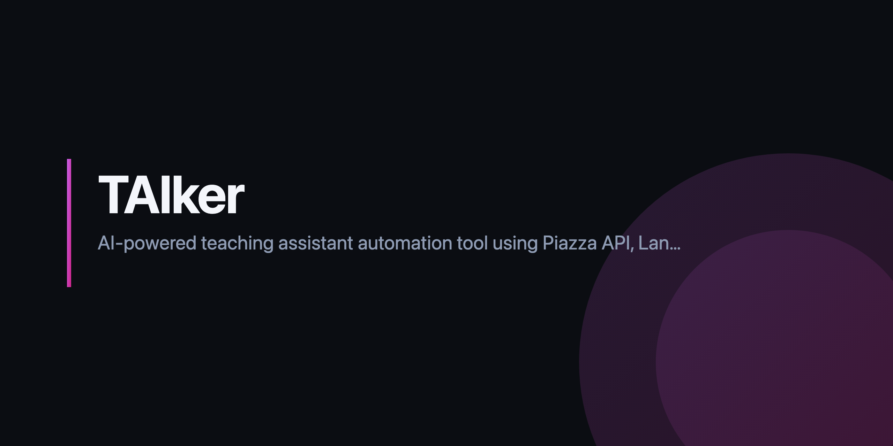

# TAlker

<p align="center">
  
</p>

A Streamlit app that answers course questions from lecture notes using
retrieval-augmented generation (LangChain + ChromaDB), plus a small Piazza bot
that can pull posts from a course. It was built for one university class and is
now a finished small project, not an actively developed product.

## What it does

- **Document ingestion** (`src/dashboard/llm.py`): loads every `.pdf`, `.txt`,
  `.md` and `.csv` under `data/` (zips are extracted first), splits them with
  `RecursiveCharacterTextSplitter`, and stores embeddings in a local ChromaDB
  at `data/.chroma_db`. A content hash decides when the index is rebuilt.
- **Retrieval**: an `EnsembleRetriever` combining BM25 (`rank-bm25` via
  LangChain) with vector search, an optional cross-encoder reranker
  (`cross-encoder/ms-marco-MiniLM-L-6-v2` via `sentence-transformers`), and
  LLM-generated query expansion. Answers come back with source chunks.
- **Providers** (`src/dashboard/providers.py`): a model catalogue and two
  factories that build LangChain chat/embedding objects for OpenAI, Anthropic,
  Google Gemini, Cohere, Ollama (local) and HuggingFace. Only the provider you
  select is imported. A `TokenTracker` estimates cost from the catalogue's
  per-token prices.
- **Evaluation** (`src/dashboard/evaluation.py`): a homegrown LLM-as-judge
  scorer with RAGAS-style metrics (faithfulness, answer relevancy, context
  precision/recall/relevancy). It prompts `gpt-4o-mini` directly and does not
  use the `ragas` library.
- **Piazza bot** (`src/piazza_bot/`): logs in with `piazza-api`, fetches posts,
  and writes them to `data/posts.csv` for the Analysis page. Auto-replying is
  wired up but needs a `parameters.py` (see `parameters.example.py`).
- **UI**: Streamlit pages for Upload, Test (chat), Analysis (post charts and a
  word cloud), Evaluation, and Settings, behind `streamlit-authenticator`.

`data/sample/` holds a tiny synthetic corpus (two markdown notes and a 5-row
posts CSV with made-up names) so the pipeline has something to index out of the
box. Everything else under `data/` is git-ignored; put your own course material
there.

## Requirements

- Python 3.10 or 3.11 (3.12+ is untested)
- [Poetry](https://python-poetry.org/)
- An `OPENAI_API_KEY` for the default configuration. The app constructs OpenAI
  embeddings on start-up, so without a key the Test, Evaluation and Settings
  pages raise an error. To run offline, set the LLM and embedding model to
  Ollama models in `.env` (`LLM_MODEL=llama3.1:8b`,
  `EMBEDDING_MODEL=nomic-embed-text`) after `ollama pull` on both.

## Install and run

```bash
git clone https://github.com/gr8monk3ys/TAlker.git
cd TAlker
cp .env.example .env            # add at least OPENAI_API_KEY
cp config.example.yaml config.yaml   # login credentials for the Streamlit auth
make setup                      # pip install poetry && poetry install --with dev
make run                        # streamlit run src/dashboard/Home.py
```

Open http://localhost:8501 and sign in with the credentials from `config.yaml`
(the example file uses `gr8monk3ys` / `abc123`; replace both before exposing
the app anywhere).

Optional Piazza integration: fill `PIAZZA_EMAIL`, `PIAZZA_PASSWORD` and
`PIAZZA_COURSE_ID` in `.env`.

## Development

```bash
make test        # pytest (62 tests, all mocked; no network or API keys needed)
make check       # black --check, ruff, mypy on the two core modules
make format      # black + ruff --fix
make clean-db    # drop the ChromaDB index so it rebuilds
```

`.pre-commit-config.yaml` runs ruff, ruff-format and the standard hygiene
hooks; CI runs the same hooks plus `pytest` on every push and PR.

Tunables (env vars or the Settings page): `LLM_MODEL`, `EMBEDDING_MODEL`,
`CHUNK_SIZE` (1000), `CHUNK_OVERLAP` (200), `INITIAL_K` (20), `FINAL_K` (5),
`BM25_WEIGHT` (0.3), `SIMILARITY_THRESHOLD` (0.3).

## Layout

```
src/dashboard/      Streamlit app: Home.py, llm.py, providers.py, evaluation.py, pages/
src/piazza_bot/     Piazza client, post handlers, response types
tests/              pytest suite (test_llm, test_providers, test_evaluation)
data/sample/        synthetic demo corpus (the only data that is tracked)
```

## License

GPL-3.0. See [LICENSE](LICENSE).
